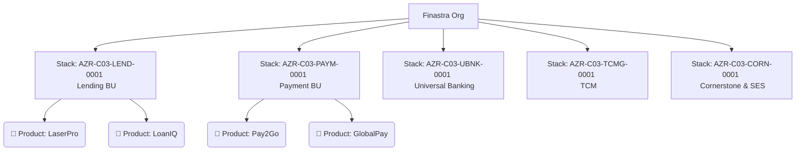
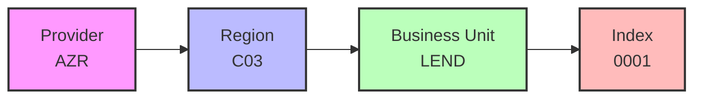

- Start Date: 2026-05-01
- Requirement/Feature Request Issue Num: SPS-2000

## Table of Contents

- [Table of Contents](#table-of-contents)
- [Summary](#summary)
- [Motivation](#motivation)
  - [Goals & Requirements](#goals--requirements)
  - [Non-Goals](#non-goals)
- [Detailed design](#detailed-design)
  - [Org structure](#org-structure)
  - [Naming](#naming)
  - [Consumption & Isolation](#consumption--isolation)
  - [Management](#management)
  - [Repository layout](#repository-layout)
  - [User stories](#user-stories)
- [Pros & Cons (v1 vs v2)](#pros--cons-v1-vs-v2)
- [Drawbacks](#drawbacks)
- [Alternatives](#alternatives)
- [Adoption strategy](#adoption-strategy)
- [How we teach this](#how-we-teach-this)
- [Security Implications](#security-implications)

## Summary

This Pattern (v2) evolves the Grafana Cloud stack management framework defined in Pattern 005. While Pattern 005 established excellent foundational principles (Single Finastra Org, GitOps workflow, Terraform automation), it utilized a **per-Product stack model** which has led to extreme operational sprawl (100+ stacks). 

This document proposes a **Business Unit (BU) aligned stack model**, consolidating the ecosystem into core BU stacks (e.g., Lending, Payment, Universal Banking). It leverages Grafana Folders, Role-Based Access Control (RBAC), and Label-Based Access Control (LBAC) to maintain strict product-level isolation and self-service, while drastically reducing operational overhead and fulfilling strict enterprise requirements around cost attribution, SRE access, and cross-tier environment visibility.

## Motivation

The initial implementation of Pattern 005's per-Product stacks resulted in a proliferation of Grafana Cloud stacks. This caused:
- **Massive Operational Overhead:** Managing, updating, and governing 100+ individual stacks.
- **Dashboard & Alert Duplication:** Common infrastructure dashboards had to be deployed and synced across 100+ instances.
- **Complex SRE Access Management:** DevOps/SRE teams supporting multiple products required disparate roles mapped across dozens of isolated physical stacks.
- **No Cross-Tier Views:** Physical stack separation made it difficult to build unified views across Dev/Stage/Prod environments.

By consolidating at the BU level, we maintain strict logical boundaries while unlocking massive operational efficiency and scalability.

### Goals & Requirements

Based on the architectural requirements established by the Observability Pod lead, this design strictly satisfies the following:

1. **Scalability:** Accommodate 2,500+ users and 100+ products across BUs. Grafana Cloud's active series limits per stack are accounted for by dividing load across BU-aligned stacks.
2. **Strict Product Isolation:** No product team may access telemetry or assets (dashboards/alerts) of another product, even within the same BU. Enforced structurally via Folders and LBAC/RBAC.
3. **Environment Tiering:** Dev/Stage/Prod are logically separated to prevent noise, but reside in the same BU stack to allow *opt-in cross-tier views*.
4. **Self-Service:** Teams are empowered to create/update/delete their configuration items (dashboards, alert rules, data-source wiring) without central team bottlenecks via IaC.
5. **Data Residency:** Stacks are deployed in specific Grafana Cloud regions matching data residency laws of the monitored workloads.
6. **Cross-Product SRE Access:** DevOps/SRE teams can be granted access to exactly the products they support across the BU, without receiving blanket access.
7. **Cost Attribution:** All consumption is strictly attributable to specific products via enforced label taxonomies.
8. **Automated IaC:** Zero manual click-ops. Stack creation, RBAC, and wiring are 100% automated.

### Non-Goals
- Modifying how telemetry data is generated at the application level (this relies on standard OpenTelemetry practices).
- Migrating PCI-DSS or heavily regulated environments that strictly require dedicated, physically isolated stacks (these remain explicitly defined exceptions).

## Detailed design

### Org structure

The structure moves from per-Product to per-Business Unit:



Within each BU stack, Products are segregated into **Folders**. This addresses the operational concerns of v1 while satisfying all isolation requirements:

- **Empowerment:** Product teams get Editor/Admin rights at their specific Folder level via RBAC.
- **Data Residency:** A BU can have multiple stacks in different regions (e.g., `AZR-C03-LEND-0001` for US Central, `AZR-E01-LEND-0001` for EU) to satisfy data laws.

### Naming

The naming convention is simplified to represent the BU and an Index, replacing the specific Product ID. The environment tier is removed from the stack name to allow Dev/Stage/Prod to coexist in the same stack for cross-tier visibility.


Example: `AZR-C03-LEND-0001`

### Consumption & Isolation

Instead of relying on the physical stack boundary for isolation, this model relies heavily on **Standardized Labels**, **RBAC**, and **LBAC (Label-Based Access Control)**.

All ingested data MUST contain the following enforced taxonomy:
- `bu` (e.g., lending)
- `product` (e.g., laserpro)
- `env` (e.g., prod, stage, dev)
- `region`

**Fulfilling Isolation Requirements:**
- **Product Isolation:** LBAC policies generated by Terraform bind to Entra ID groups. A user in the LaserPro group gets an LBAC policy `{product="laserpro"}`. They physically cannot query data for `product="loaniq"`.
- **Environment Isolation & Cross-Tier Views:** Because Dev, Stage, and Prod data for LaserPro reside in the same stack, they are logically separated by the `env` label. Dashboards default to `env="prod"` to prevent noise, but users can opt-in to cross-tier views by changing the dashboard variable to `env=~"prod|stage"`.
- **Cross-Product SRE Access:** An SRE team supporting both LaserPro and Pay2Go is granted an LBAC policy `{product=~"laserpro|pay2go"}` and assigned RBAC to both product folders.

### Management

The deployment and management flow remains mechanically identical to Pattern 005, enforcing "no manual click-ops":
1. Contributor updates IaC in the `main` branch.
2. PR approved by Product CODEOWNERS.
3. Merge triggers GitHub Actions.
4. Release branch triggers Terraform Cloud.
5. Terraform updates Grafana Cloud (Stacks, Folders, Data Sources, RBAC, LBAC) and Azure Entra ID.

### Repository layout

The repository layout is adjusted to group configurations by BU and then by Product.

```bash
├── .github/
│   └── CODEOWNERS               # Permission configuration per BU and Product
├── organisations/               
│   ├── Lending/                 # BU Level
│   │   ├── main.yaml            # BU-level defaults
│   │   ├── LaserPro/            # Product folder
│   │   │   ├── dashboards/      # Product-specific dashboards
│   │   │   ├── alerts/          # Product-specific alert rules
│   │   │   └── main.yaml        # Product configuration (RBAC, LBAC mappings)
│   ├── Payment/
│   │   ├── main.yaml
│   │   ├── Pay2Go/
│   │       ├── dashboards/
│   │       └── main.yaml
│   └── main.yaml                # Global fallback configuration
```

### User stories

#### Story 1: Cost Attribution
> **As** a Finastra VP
> **I want** to see exactly how much Grafana Cloud consumption is attributable to the LaserPro product
> **So that** I can accurately chargeback the cost to that P&L.

**Implementation:** With stacks consolidated by BU, billing at the stack level shows the entire BU's consumption. Terraform provisions cost-attribution dashboards within the stack that filter the `grafanacloud_usage` metrics by the enforced `product="laserpro"` label, providing exact active series, log volume, and trace span costs.

## Pros & Cons (v1 vs v2)

| Aspect | v1 (Per-Product Stacks) | v2 (BU-Aligned Stacks) |
|--------|-------------------------|------------------------|
| **Management Overhead** | High (100+ stacks to maintain) | Low (~5-6 stacks) |
| **Cross-Tier Environment Views**| Impossible | Supported natively |
| **SRE Multi-Product Access** | Complex (Requires access to many stacks) | Simple (Combined LBAC/RBAC in one stack) |
| **Data Isolation** | Physical (Stack level) | Logical (LBAC + RBAC level) |
| **Cost Attribution** | Native (Stack billing) | Label-based (Requires strict labeling) |

## Drawbacks

- **Label Discipline:** Isolation and cost attribution now entirely depend on strict enforcement of ingestion labels (`product="xyz"`). If ingestion pipelines drop these labels, data attribution fails. This must be enforced at the collector/Alloy level.

## Alternatives

- **Continue with Pattern 005 (Per-Product):** Rejected due to the unsustainable operational burden of managing hundreds of stateful environments and the inability to provide cross-tier observability.
- **Single Finastra Global Stack:** Rejected due to guaranteed scaling limit breaches (active series limits) and excessive blast radius if configuration is corrupted.

## Adoption strategy

1. **Provision New Stacks:** Create the BU-aligned stacks via Terraform.
2. **Update Collectors:** Shift telemetry ingestion endpoints from the old per-product stacks to the new BU stacks, enforcing label injection (`product`, `env`, `bu`) at the collector level.
3. **Migrate Assets:** Use automation to copy dashboards and alerts from old stacks into their respective product folders in the new stacks.
4. **Deprecate:** Set old stacks to read-only, then delete after 60 days.

## How we teach this
- Update existing documentation to focus on Folder and LBAC concepts rather than Stack concepts.
- Document labeling taxonomies as a strict governance artefact.

## Security Implications
Relies heavily on LBAC and RBAC. A misconfigured LBAC policy in Terraform could expose Product A's data to Product B. We will implement strict PR validation to ensure LBAC policies match the `CODEOWNERS` hierarchy, ensuring zero cross-product data leakage.
